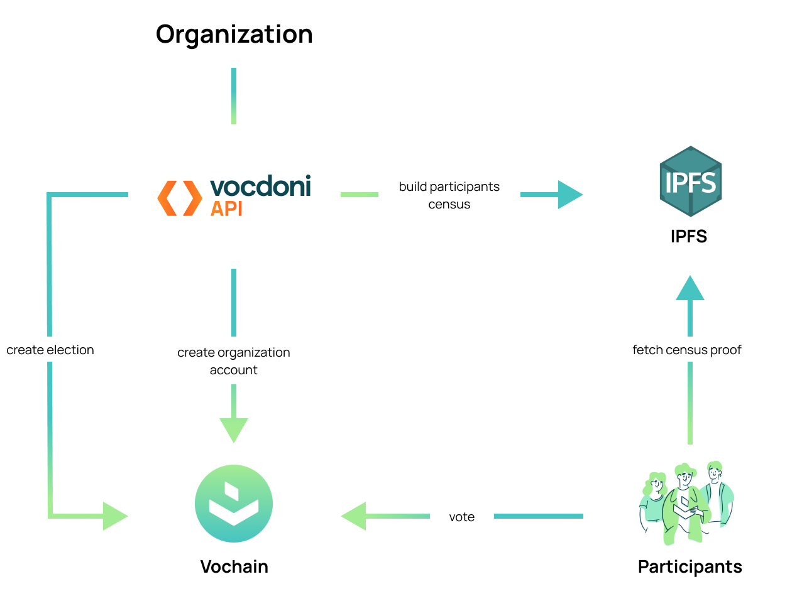
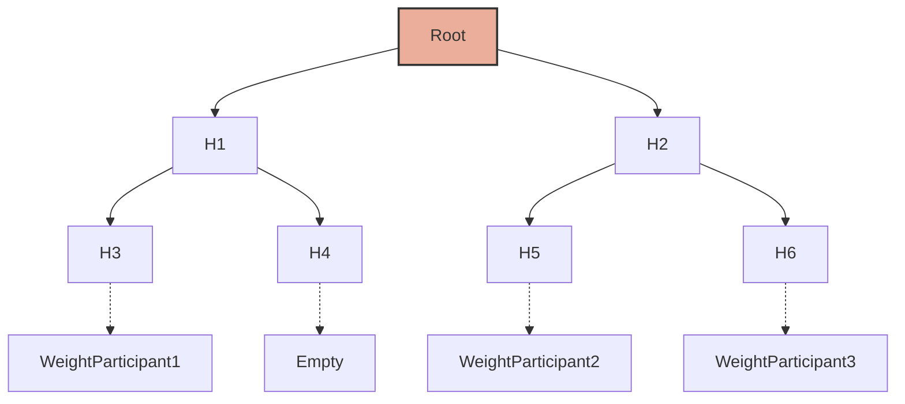
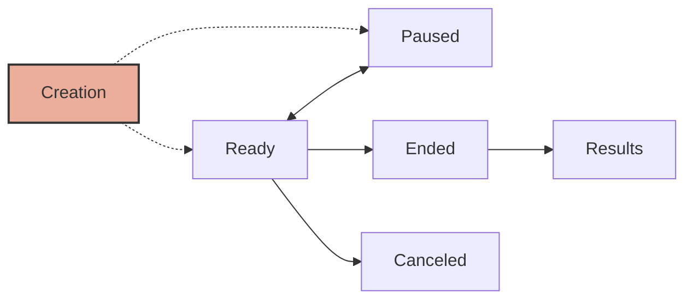

# Vocdoni introduction

Voĉdoni in Esperanto translates to "to give voice". We aim to achieve change by empowering society from the bottom up, building the necessary primitives and tools to enable every voice to be heard, from a few individuals to millions of citizens. We aspire to be the most accessible and functional toolset on earth, open to every group of people, regardless of their position or resources.

We perceive voting as a collective signaling mechanism "to give voice", that can be fully digitalized, iff provided with cryptographic guarantees about its integrity and its outcome. To this end, we have designed and implemented the Vocdoni Protocol, a universally verifiable set of rules and primitives that allow anyone to create and participate in collective decision making.

## 1.1 The blockchain

The Vocdoni blockchain is named **Vochain**. It is a Byzantine fault-tolerant network based on [Tendermint](https://tendermint.com/) that executes the Vocdoni Protocol logic represented as a state machine. Its main purpose is to register votes in a decentralized and verifiable format. Currently, the network can process more than 30K votes per minute while using no more than the resources found on commodity computers.

The Vocdoni blockchain requires a native token (VOC) to execute management transactions (i.e creating elections), but not for casting votes. Therefore, the voters can participate in governance processes in a free and gasless manner.

Vochain is currently based on Proof-of-Authority consensus. However, we are already working towards transitioning to Proof-of-Stake in 2023. Until then, the tokens are free and can be obtained by anyone by using our faucet service.

The current vocdoni-node code can be found [in our github repository](https://github.com/vocdoni/vocdoni-node/tree/master/vochain).

## 1.2 Gateways

The Gateways provide entry points to our P2P network. They allow clients to reach decentralized services through a standard **HTTP(s) API interface**.

Internally, the Gateways act as a standard blockchain full node, but also as indexers, meaning that they store and update a separate non state-related database that containg digested information useful for fulfilling client query requirements. For instance, **Gateways compute election results** (which are not part of the state) and provide census services (so voters can fetch their election Merkle proof). To perform the indexer function, Gateways need access to the auxiliary distributed filestore.

## 1.3 Distributed storage

Vocdoni currently relies on the [InterPlanetary File System (IPFS)](https://www.ipfs.tech/) for storing auxiliary information. In a voting process, this includes information such as texts (questions, descriptions, and options), complementary images, as well as census. This data does not need to be permanent in order to ensure the voting guarantees, and is expensive to keep it around, so it is published to IPFS until it can be discarded.

We have designed the Vocdoni primitives in a modular fashion, which allows us to incorporate more data layers in the future, such as Ethersphere Swarm, DAT, STORj or Filecoin.

# 2. Process overview

This section provides an overview of the Vocdoni flow for creating a participatory process, its main attributes, and configuration options.

The following diagram is a summary of the flow, from creating an organization account to the vote casting.

Let's explore in more detail the different concepts.

## 2.1 The census

The census is a key component of every voting process. It defines the set of users (identified by a public key or address) who are elegible for participating in a election.

Vocdoni is designed to be as flexible as possible and to enable, at the very least, the most common use cases for elections. To this end, the protocol currently supports several census types and origins, and more may be added in the future.

The current census origins available are:

+ **weighted merkle tree:** for standard elections, allowing participants to vote with different "weights" (e.g. someone with 50 points might have 50 votes)
+ **indexed merkle tree:** an optimized merkle tree for voting on zkSnarks
+ **credential service provider (CSP):** for elections where an authority provides voting credentials (such as OAUTH, mailing, SMS, etc.)
+ **ERC20 based on storage proofs:** for Ethereum based tokens, the user needs to fetch an EIP1186 proof from a web3 provider (implemented as part of https://voice.aragon.org)

The current implementation of our Vocdoni API/SDK only provides the weighted merkle tree, so we will focus on this specific origin. More options will become available in the following months.

#### Weighted merkle tree census

The census itself is represented as a binary [Merkle Tree](https://en.wikipedia.org/wiki/Merkle_tree), where the keys of the tree contain the (hashed) public keys or addresses of all eligible voters and the leafs (values) represent the voting weight.

Using Merkle Trees, we can efficiently prove that a key/value belongs to the tree. For a tree of size `N` elements, only `log(N)` elements are needed to generate a proof. A tree with 1 million leaves, for example, would only need 20 hashes to prove the inclusion of any one leaf. 

A **prover** is able to prove the inclusion of any leaf of the Merkle Tree to a **verifier**:
+ The **verifier** only needs to know the Root Hash
+ The **prover** only needs to provide the Leaf and its Sibling, as well as the siblings of each of its ancestors (hence, `log(N)` elements).

## 2.2 Accounts

A Vocdoni account is identified by an Ethereum-like address. This allows us to use standard Web3 signers such as Metamask.

An account can:

+ Create and manage elections
+ Transfer tokens
+ Authorize other accounts to act on his behalf (delegates)
+ Manage its metadata

For creating an account, a faucet package is required, since bootstrapping requires a fee in Voc tokens. At the moment, Vocdoni provides a free faucet service for distributing such tokens (integrated within the client SDK).

An account often represents an organization and might have associated an `infoURL` pointing to an external IPFS file contaning the metadata details (name, description, logo, etc.). All Vochain nodes automatically distribute and store this data. 

## 2.3 Elections

An Election (named a `process` internally) is a rule-set of options and requirements written into the blockchain state, thus guaranteeing that they can no longer be modified (unless explicitly configured to be upgradeable). The election is created and configured by an account owner or account delegates.

The following election options can be configured:

+ **Census origin:** description of the eligible voters or rules.
+ **Lifecycle:** initial state, start, and end blocks.
+ **Election mode:** how should the process behave.
+ **Vote mode:** the kind of ballots expected from voters.
+ **Tally mode:** how should the results be computed as defined by the Vocdoni Ballot protocol. Details and examples can be found [here](https://blog.aragon.org/vocdoni-ballot-protocol).

#### Election lifecycle states

An election must be in one of the following states:

+ **Ready:** the process is open to voters.
+ **Paused:** the process is active, but votes are not accepted.
+ **Ended:** the process is finished and the state can no longer be updated.
+ **Canceled:** the process is terminated by the election official and is no longer considered valid.
+ **Result:** the process has ended and results have been published.

The states can transition in the following ways:

#### Election mode

+ **Auto-start:** Enables the voting process to be started manually by the election administrator, as opposed to setting a start date.
+ **Interruptible:** The election administrator may pause or end the process at any point in time.
+ **Encrypted metadata:** Allows the questions and options of a process to be encrypted, so an external observer won't be able to see the questions unless they have the key.
+ **Dynamic census:** By default, the census is immutable and  cannot be changed once published. However, long lasting polls may enable a dynamic census so that new members of a community may vote on a process after joining. 
+ **Allow override:** If enabled, a voter may vote multiple times and replace any prior vote envelope. This protects voters from coercion and accidental mistakes.

#### Vote mode

+ **Anonymous:** If enabled, the voter’s public key will remain unrecoverable. Instead, the voter will prove that they are registered to vote by computing a zk-SNARK proof (ZKP) on their device. If this option is not chosen, the vote envelope will contain a signed vote, resulting in a pseudonymous vote. If an observer correlates the voter’s public key with personal data, the voter could be identified.
+ **Encrypted:** If enabled, the payload of the votes emitted will remain encrypted until the end of the process. The results will be available once the encryption keys are published by the miners at the end of the process. If disabled, the results can be seen in real time.
+ **CostFromWeight:** If enabled, the total cost defined in the ballot protocol will equal the voter's census weight.

## 2.4 Anonymous vote

A voting envelope is composed of two parts: the census proof (which defines the eligibility of the voter) and the ballot (the actual contents of the vote, containing the chosen options). The anonymization of the voting envelope is achieved by anonymizing the census proof using zk-SNARKs technology.

zk-SNARK proofs are a convenient method to prove something to a third-party verifier without revealing the contents of what is being proven.

The goal of the Vocdoni zk-SNARK circuit is to prove that a voter (identified by a public key) is part of a Census (a Merkle Tree composed of such public keys) without revealing the identity (public key) of that voter. This circuit produces a unique and deterministic identifier (nullifier) that can be processed by a public ledger/blockchain to distinguish whether the voter has previously submitted a vote.

*Note: while zk-SNARK voting is enabled in the protocol and available at [https://vocdoni.app](https://vocdoni.app), it is not yet implemented as part of the current SDK.*

## 2.5 Results

The results are computed by a set of rules configured by the election owner and following the [Vocdoni ballot protocol](https://blog.aragon.org/vocdoni-ballot-protocol), which allows for almost any type of voting such as Range or Quadratic.

Results are represented as a matrix of numbers such as `[ [1,2], [0,1] ]` which can be interpreted as:

+ for the first question, the first option received 1 vote and the second option 2 votes
+ for the second question, the first option received 0 votes and and the second option 1 vote

Currently, the results computation is not part of the blockchain state logic, due to its potential resources cost (especially for large elections). To mitigate this issue, we introduced a special set of nodes called `Oracles` that are responsible for computing the results offchain and sending the digested results via an on-chain transaction.

The Gateway nodes will also compute the results locally, so the end user can either trust the Gateway to which they are connected or use the list of Oracles. 

Verifiability is guaranteed, since every end user may fetch the list of votes of an election from the blockchain state and reproduce the tally locally.

## 2.6 Transactions and fees

Vochain transactions are protobuf encoded and signed by the sender. However, the SDK handles this operation transparently for the end user.

Transactions may have a fee that the sender needs to cover from its own balance. The fee cost per transaction is currently fixed and configured in the blockchain genesis file. At the moment, once a transaction is executed, the fee is automatically burned. This is an intermediate solution that will become invalid once the full features of the Voc tokenomics chain are implemented.

The following list shows the transactions:

#### Organization accounts
+ CreateAccount
+ SendTokens
+ CollectFaucet
+ NewProcess
+ SetProcessStatus
+ SetAccountInfoURI
+ SetProcessCensus
+ SetProcessQuestionIndex
+ AddDelegateForAccount
+ DelDelegateForAccount

#### Election participants
+ Vote

#### Oracles
+ RegisterKey
+ SetProcessResults

# More information

+ [paper (not yet published) about Vocdoni](https://law.mit.edu/pub/remotevotingintheageofcryptography/release/1)
+ [oficial vocdoni docs (outdated)](https://docs.vocdoni.io)
+ [vocdoni blog](https://blog.vocdoni.io)